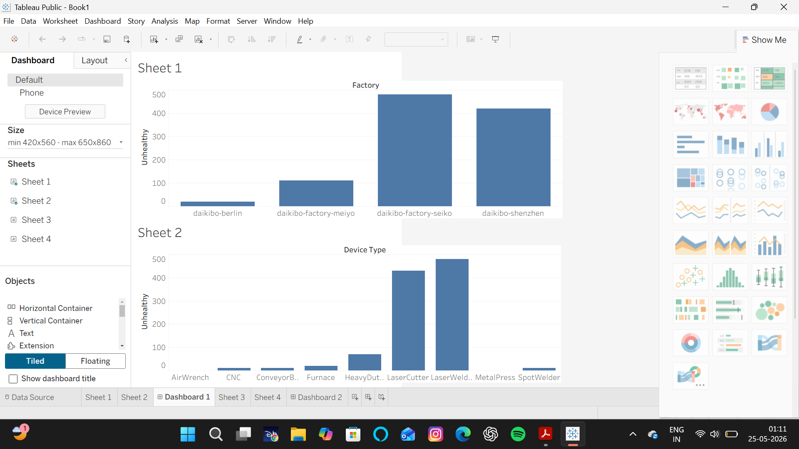

# Manufacturing Equipment Health Dashboard (Tableau)

## Overview
This project analyzes equipment health across multiple manufacturing facilities using Tableau. The dashboard helps identify factories and device types with the highest number of unhealthy devices, enabling faster operational monitoring and decision-making.

## Tools Used
- Tableau
- Data Visualization
- Dashboard Design
- Data Analysis

## Dashboard Features

### Factory-wise Equipment Health Analysis
- Compare unhealthy device counts across factories.
- Identify facilities with the highest maintenance concerns.

### Device Type Analysis
- Analyze unhealthy devices by equipment type.
- Detect device categories contributing most to operational issues.

### Interactive Dashboard
- Visual comparison between factories and equipment categories.
- Easy-to-understand charts for operational monitoring.

## Key Insights
- Certain factories recorded significantly higher unhealthy device counts than others.
- A small number of equipment categories accounted for most unhealthy devices.
- The dashboard enables quick identification of maintenance priorities.

## Dashboard Preview

## Skills Demonstrated
- Tableau Dashboard Development
- Data Visualization
- Manufacturing Data Analysis
- KPI Monitoring
- Interactive Reporting

## Files Included
- Manufacturing_Equipment_Health_Dashboard.twbx
- dashboard.png
- README.md

## Author
Ashwath S

